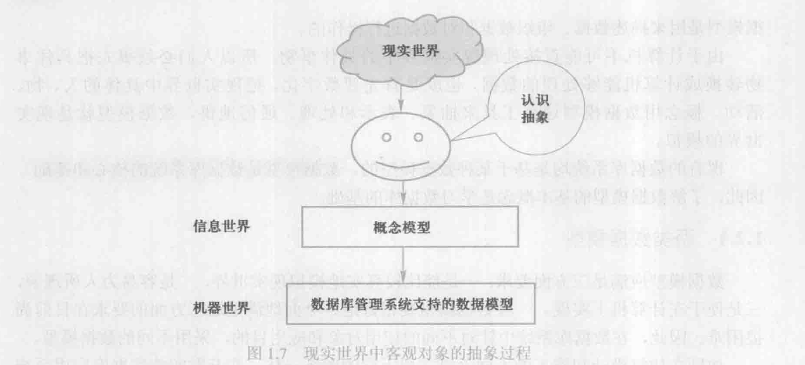
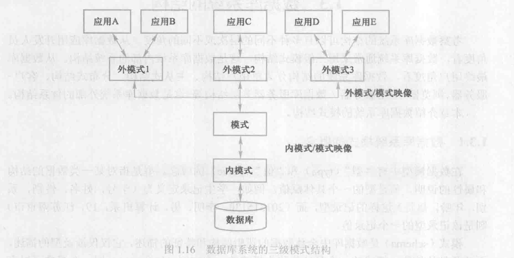

# 绪论

## 数据库系统概述

### 四个基本概念

- 数据：数据库中储存的基本对象/描述事物的符号记录

  - Structured data: numbers, text, dates，etc.——结构化数据：数字，文本，日期，等
  - Unstructured: images, video, documents——无结构数据：图像，视频，文档(不能用统一的结构表示)
  - Metadata(元数据)：描述最终用户数据的属性或特征以及数据的上下文的数据

  ```
  元数据，英文名为Metadata，是一种用于描述数据的数据。它提供了关于某个数据项的详细信息，但并不是数据本身的内容。我们可以将元数据理解为数据的“说明书”或“标签”，它帮助人们了解数据的来源、结构、特性、用途和约束等。元数据在数据库管理、资源检索和数据分析中扮演着至关重要的角色。

  以一个简单的例子来说明：假设我们有一本图书，书中的文字、图片、图表等就是主要的数据。而这本书的书名、作者、出版日期、ISBN号码等信息，就可以被视作这本书的元数据，因为它们描述了这本书的基本特征和相关的上下文信息，而这些信息有助于读者、图书馆管理员或书商更好地理解、管理和利用这本书。
  ```
- 数据库管理系统（**DBMS**）

  - 数据定义：数据定义语言（**DDL**）[ CREATE, ALTER, DROP ]
  - 数据组织/存储/管理
  - 数据操纵语言（**DML**） [INSERT, UPDATE, SELECT ]
  - 事务（Transaction）管理/运行管理以及建立/维护
  - 数据库管理员DBA
  - **DCL**-数据控制语言[GRANT REVOKE授权命令]、DQL-数据查询语言 [SELECT]
- 数据库系统：由数据库、数据库管理系统(及其应用开发工具)、应用程序和数据库管理员(DBA)组成的存储、管理、处理和维护数据的系统

### 数据库系统组成（如上图）

* **Data modeling and design tools** : automated tools used to design databases and application programs——数据建模及设计工具
* **Repository** :centralized storehouse of metadata——系统库，集中存储元数据，中文文献里通常称为数据字典（DD：Data Dictionary），DBMS中专门存放数据库对象的定义的系统数据库（注意与第7章需求分析阶段，需求分析说明书/需求规格说明书，中的“ **数据字典** ”相区别）。
* [**Database management system(DBMS)**](): software for managing the database——DBMS与OS的关系：DBMS调用OS。
* **Application programs** : software using the data——应用程序
* **User interface** : text, graphical display, menus, etc. for user ——UI：用户接口
* **Data/database administrators** : personnel responsible for maintaining the database——DBA，数据库管理员
* **System developers** : personnel responsible for designing databases and software——设计开发人员
* **End users** : people who use the applications and databases——终端用户

  > 在数据库系统（DBS）中，最重要的软件是DBMS，最重要的人是DBA。
  >

### 数据库系统跟文件系统的区别

- 从文件系统到数据库系统标志着数据管理技术的飞跃
- 数据系统跟文件系统最本质区别：**整体数据结构化(comprehensive data structuring)**
- Data independency ——数据独立性（应用程序和数据互不干扰）
- Redundancy ——冗余度（一个字段在多个表里重复出现[缺点]）
- Scalability ——易扩展性

### 数据独立性

- 数据独立性是借助数据库管理数据的一个显著优点,它已成为数据库领域中一个常用术语和重要概念,包括数据的物理独立性和逻辑独立性。
- 物理独立性是指**用户的应用程序**与数据库中数据的**物理存储**是相互独立的。
- 逻辑独立性是指**用户的应用程序**与数据库的**逻辑结**构是相互独立的。
- 数据独立性由DBMS提供的二级映像保证

```
数据独立性由DBMS（数据库管理系统）提供的两个级别的映射或模式来保证：逻辑模式和物理模式。

1. **逻辑模式（Schema）：**这是整个数据库结构的抽象描述，它描述了数据库中所有的数据对象、数据项之间的关系、数据的规则等，而不考虑这些数据是如何在物理存储设备上存储的。应用程序是依据逻辑模式来进行设计的。

2. **物理模式（Storage）：**这是数据实际在存储介质（如硬盘）上的保存方式，涉及到数据的存储路径、存储结构、索引方法、压缩方式等，是DBMS的内部事务。

DBMS中存在着两个重要的映射：

- **逻辑模式与物理模式的映射：**这个映射确保即使物理存储方式发生变化（如更换存储设备、分配不同的存储空间、更改记录的存储格式等），这些变动也不会影响到逻辑模式，在应用程序的视角，数据库看起来并没有变化。

- **外部模式与逻辑模式的映射：**外部模式，也称子模式或视图，是针对不同用户或应用程序的数据表示。这个映射确保用户操作的是与他们的应用需求相匹配的数据库的视图，即使逻辑模式发生变化（如添加新的表或属性等），只要外部模式保持不变，应用程序也不需要修改。

这两级映射保证了数据的独立性：

- **逻辑数据独立性：**是指修改逻辑数据模式而不必修改外部模式或应用程序。例如，可以在不影响应用程序的情况下添加新的表或列。

- **物理数据独立性：**是指修改物理数据存储方式而不必修改逻辑模式。例如，可以更改文件的存储设备，或者将数据存储在新的位置，逻辑模式仍然保持不变，不会影响到应用程序。
```

## 数据模型

```
静态特性（Static Features）：静态特性关注的是数据本身的组织形态和存储结构。它定义了系统中数据的结构，包括数据的类型、格式、和实体之间的关系，以及数据如何组合成表、记录和字段等。例如，在ER模型中静态特性包括了实体、属性和实体之间的关系；在关系模型中，包括了表结构、列（字段）和数据类型定义等。

动态特性（Dynamic Features）：动态特性描述的是数据在数据库系统中随时间发生变化的过程，即数据的行为和可能发生的变化。它包括数据库操作如何影响数据，如增加、删除、更改和查找数据。在数据库设计中，这常常通过定义事务、数据库操作和数据库触发器等来实现。动态特性确保数据库可以响应用户的查询请求，并能够执行复杂的数据操作。

完整性约束条件（Integrity Constraints）：完整性约束描述了数据必须满足的规则和条件，以保持数据的准确性和一致性。这些约束条件能够确保数据符合业务规则和逻辑要求。完整性约束条件包括：
- 实体完整性：要求表中的每条记录都可以通过一个唯一的标识符（主键）加以区分。
- 参照完整性：确保外键的值必须对应另一表的存在记录或是空（NULL）。
- 用户自定义的完整性：根据具体的应用需求，用户可以定义其它的约束条件。
```

### 两类数据模型

- 数据模型划分为两大类：概念模型conceptual model（用于数据库的设计）和逻辑logical/物理physical模型（管理数据库）

  ```
  概念模型：主要用于描绘现实世界情景和把握大的业务范围。它更多地关注于企业级的全局数据视图和业务需求，而不触及数据如何在数据库中实现存储。
  逻辑模型：在概念模型的基础上，将其进一步细化，关注于数据的结构和关系。逻辑模型描述了数据之间的逻辑关系，以及数据如何在系统中组织起来。
  ```
- 物理模型是对数据最底层的抽象
- 逻辑模型主要包括（定义数据的逻辑结构，以及数据之间的逻辑关系，但不涉及数据的物理存储细节）：

  - **层次模型(hierarchical model)**
  - **网状模型(network model)**
  - **关系模型(relational model)**
  - 面向对象数据模型(object oriented data model)和对象关系数据模型(object relational data model)、半结构化数据模型(semistructured data model)



```
层次模型(Hierarchical Model): 这是一种数据库模型，其结构是以树状结构组织数据。每个数据只有一个父节点，但可能有多个子节点。这种模型的代表是IBM的信息管理系统(IMS)。

网状模型(Network Model): 该模型是基于层次模型的改进版，其中的数据对象可以有多个父对象，从而形成一个网络。在此模型中，数据和关系都被作为记录类型存储。

关系模型(Relational Model): 该模型是根据数学关系理论建立的，数据以二维表的形式进行组织，在不同的表对象之间，基于公共属性定义的关系连接。这是现在被广泛应用的数据库模型。

面向对象数据模型(Object Oriented Data Model): 这种模型很好的描述了现实世界中的对象和它们之间的各种关系。它封装了数据和处理数据的方法，这些都是定义在数据的类(class)中的。

对象关系模型(Object Relational Model): 这是面向对象数据模型和关系数据模型相结合的产物，试图在关系数据库系统的基础上，引入面向对象的概念。例如，ORACLE就是该模型的典型代表。

半结构化数据模型(Semistructured Data Model)，它适用于不需要严格结构化的数据，如XML和JSON。这种模型尽可能使得数据模型更加灵活，来适应数据结构的多样性。
```

### 数据模型组成要素

- 数据结构：数据库组成对象以及对象之间的联系 i.e.层次结构/网状结构/关系结构
- 数据操作：对数据库各种对象的实例允许执行的操作的集合
- 数据的完整性约束

> Data Structure  （数据结构） , Data Manipulation  （数据操作） and Data integrity Constraints （数据的完整性约束条件）称为数据模型三要素（  Three elements ）。

### ER模型：概念模型的一种表示方法

- ERD: A graphical system used to capture the nature and relationships among data made up [entities]()（实体）, attributes （属性）and relationships —conceptual model level（用于数据库的设计）
- entity（实体）, attribute （属性）and relationship（联系）称为ER模型三要素（Three elements）。

## 数据库系统结构

### 数据库系统模式的概念

- 模式相对稳定，实例相对变动
- 体系结构：三级模式结构，提供两级映像功能：
- 模式也称逻辑模式, 是数据库中全体数据的逻辑结构和特征的描述,是所有用户的公共数据视图
- 外模式也称子模式(subschema)或用户模式,它是数据库用户(包括应用程序员和最终用户)能够看见和使用的局部数据的逻辑结构和特征的描述,是数据库用户的数据视图,是与某一应用有关的数据的逻辑表示
- 内模式也称存储模式(storage schema),一个数据库只有一个内模式。它是数据物理结构和存储方式的描述,是数据在数据库内部的组织方式
- **三级模式二级映像保证数据独立性**

### **Relational database**-关系数据库

> Relational database: a database that represents data as a collection of dimensional tables in which all data relationships are represented by common value in related tables.

关系数据库：以二维表集合来表示数据，以公共属性值表示数据间联系的数据库。
