# **Relational database（RDB：关系数据库）**

## 关系模型

### 关系的度/目

- 关系是笛卡尔积的有限子集
- 目或度（Degree）：这是指关系中属性的数量。例如，如果某个关系包含“姓名”和“年龄”两个属性，那么它的度就是2，因为它包含两个属性。
  - **单元关系（Unary Relation）** ：当关系的度（即属性数量）为1时称为单元关系或一元关系。比如，一个存储年龄的表只有一个字段“年龄”，那么它就是一个一元关系。
  - **二元关系（Binary Relation）** ：当关系的度为2时，这个关系被称为二元关系。好比一个储存员工姓名和员工ID的表，由于只涉及到两个字段，因此称为二元关系。
- 各种码：
  - 候选码：一个或一组属性，这些属性能够唯一地标识关系中的每个元组（或记录），而且这个属性组的任何子集都不能做到这点。
  - 主码：当一个关系有多个候选码时，数据库设计者选择其中一个作为主码（或主键）【非空且唯一】
  - 主属性/非主属性：包含在候选码当中的属性叫主属性

### 关系模型数据结构

The Data Structure of relational model： relation (dimensional tables) ——关系模型的数据结构：关系（二维表）

## 关系操作

### 基本关系操作

- 关系模型中常用的关系操作包括查询(query)操作**和**插入(insert)、删除(delete)、 修改(update)操作两大部分
- 查询操作又可以分为选择(select)、投影(project)、连接(join)、除(divide)、并(union)、差(except)、交(intersection)、笛卡儿积等。其中**选择、投影、并、差、笛卡儿积**是5种基本操作

### 关系操作特点

集合操作方式，即操作的对象和结果都是集合

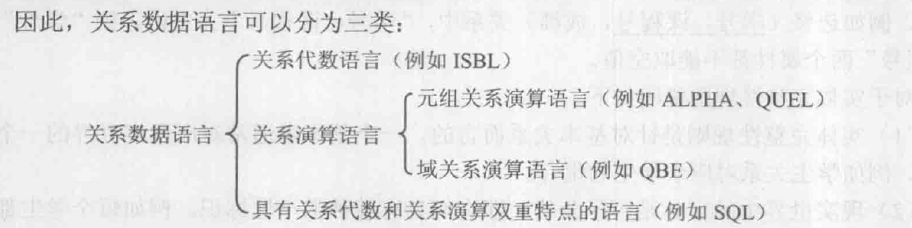

## 关系完整性

关系模型中有三类完整性约束: **实体完整性(entity integrity)、参照完整性(referential integrity)和用户定义的完整性(user-defined integrity)**

```
在数据库系统中，完整性约束是用来保持数据库正确性和逻辑一致性的限制条件。以下是关系数据库的三种基本完整性约束，及哪些操作可能对其完整性造成影响以及系统应该如何处理这些影响。
实体完整性（Entity Integrity）

实体完整性要求表中的主键不能有空值，保证每行数据的唯一性。这决定了每个实体的独立存在。
可能影响的操作：
插入操作（INSERT）：如果尝试插入一个主键为空的记录，会违反实体完整性。
更新操作（UPDATE）：如果尝试将主键列更新为NULL值，或者更新为一个已存在的主键值，会违反实体完整性。
系统应该怎么办：系统应该拒绝这种插入或更新操作，并给出错误提示，防止实体完整性被破坏。

参照完整性（Referential Integrity）
参照完整性确保外键的值必须在其指向的主键表中对应的主键列出现，除非外键的值为NULL（在可以为NULL的情况下）。这维护了表之间的一致性。
可能影响的操作：
插入操作（INSERT）和更新操作（UPDATE）：试图在存在外键的表中插入或更新一个在主表中无对应主键值的记录将违反参照完整性。
删除操作（DELETE）：在被引用的主表中删除有对应外键引用的记录将违反参照完整性。
系统应该怎么办：对于插入和更新操作，系统也应该拒绝这些操作并返回错误。对于删除操作或者更新主键操作，系统应该实施“级联”操作的策略（如CASCADE DELETE），自动删除或更新那些参照被删除或修改的主键的子表中的相关记录。
-------------------
插入操作（INSERT）
假设我们有两个表：学生表（Students）和课程表（Courses）。每个学生都可以选修多门课程，课程表中有一个字段为学生ID，这是学生表的主键，同时也是课程表的外键。
现在，我们试图在Courses表中插入一个新的记录，该记录的学生ID是1234，但是在Students表中并没有学生 ID为1234的学生。这个插入操作就会违反参照完整性，因为外键的值必须在主表（这里是Students表）中有对应的主键值（这里是学生ID）。
更新操作（UPDATE）
还是用上面的例子，假设在课程表（Courses）中已经有一条记录，其学生ID为5678。然而，如果我们试图将这条记录的学生ID更新为9876，而在Students表中并不存在学生ID为9876的学生，那么这个更新操作就会违反参照完整性。
删除操作（DELETE）
假设现在有一个学生，学生ID为5678，而在Courses表中存在多条记录的学生ID都为5678。如果我们试图删除Students表中学生ID为5678的学生，会导致Courses表中多条记录的外键值没有在Students表中对应的主键值，这个删除操作就会违反参照完整性。
-------------------
用户定义的完整性（User-Defined Integrity）
用户定义的完整性指的是业务规则的实现，它可以是任何不属于实体完整性或参照完整性的特定规则。
可能影响的操作：
插入操作（INSERT）和更新操作（UPDATE）：可以通过试图插入或更新不符合用户定义约束的数据来违反用户定义的完整性。
系统应该怎么办：系统应该验证所有的INSERT和UPDATE操作，确保所有用户定义的完整性约束被满足。如果发现违规，操作应当被拒绝并通知用户错误信息。
```

### 三大完整性

- **实体完整性**：主属性非空
- **参照完整性：**

  ```

  参照完整性是关系型数据库中的一个核心概念，它确保了数据库的数据之间保持一致性和准确性。参照完整性规则可以用来确保外键（Foreign Key）的值要么为空，要么是另一个表中主键（Primary Key）的有效值。这有助于保持数据之间的逻辑关系，并防止数据不一致。

  ### 基本组成：

  - **基本关系R**: 在这里说的基本关系，可以理解为一个数据库表。

  - **属性(或属性组)F**: 称为外码（外键），存在于基本关系R中，用于和另一个关系S建立联系。

  - **基本关系S**: 另一个数据库表，它含有与R中外键F对应的主码（主键）K。

  ### 参照完整性规则要求：

  1. **外键值为空**：R中的元组可以在F上拥有空值，这意味着这个元组没有与关系S中的任何元组相关联。

  2. **外键值为有效主码值**：如果R中的元组在F上有非空值，那么这个值必须是S中某个元组的主码值。这保证了R中的元组通过F所指向S中确实存在的元组。

  ### 举个例子：

  假设有两个表：学生表（Students）和班级表（Classes），其中班级表的主键是班级ID，学生表中有一个外键列指向班级ID。

  - 参照完整性确保了每名学生所在的班级，要么是在班级表中有记录的有效班级（外键值对应班级表中某个班级的主键），要么就是未指定（外键值为空）。

  如果在学生表中尝试插入或者更新一个元组，使得其班级ID既不是空值也不指向一个在班级表中存在的班级ID，那么数据库将违反参照完整性规则，并阻止这次插入或更新操作。

  通过遵守参照完整性规则，数据库保持了数据之间的正确关系和逻辑一致性，确保了数据的质量和可靠性。
  ```
- **用户定义完整性：**针对某一**具体关系数据库**的约束条件

## 关系代数

### 传统集合运算

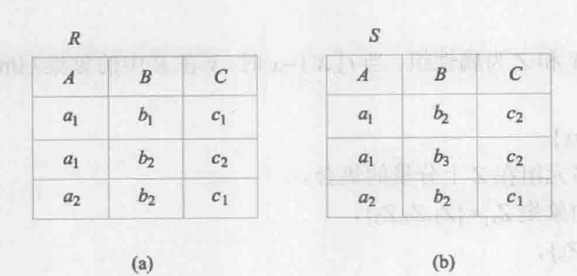

##### 并 ∪

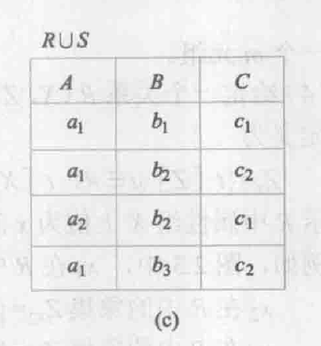

##### 差 ➖

R - S = { t | t ∈ R ∧ t ∉ S }

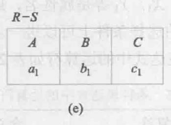

##### 交 ∩

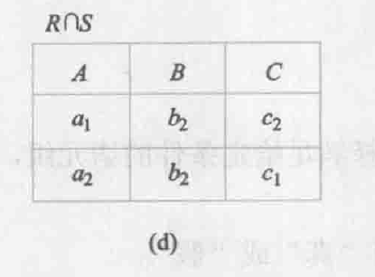

##### 笛卡尔积 ×

R × S = { tf | t ∈ R ∧ f ∈ S }

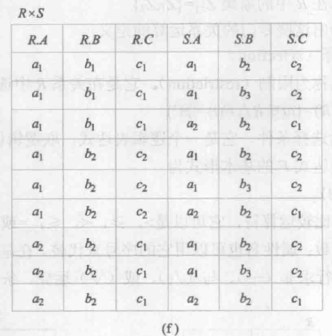

### 专门的关系运算

##### 选择 σ（selection）

小字部分是限定条件

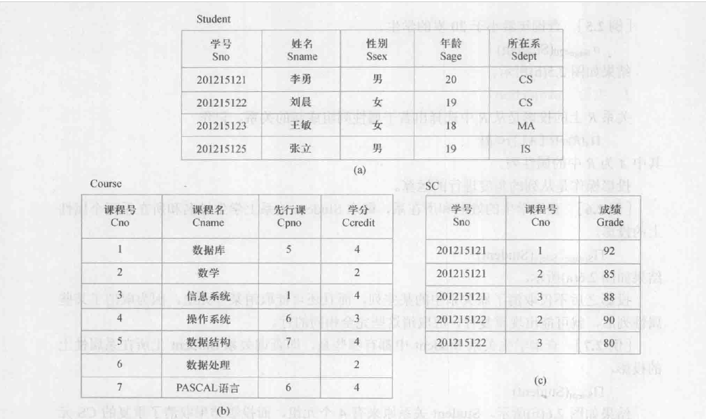

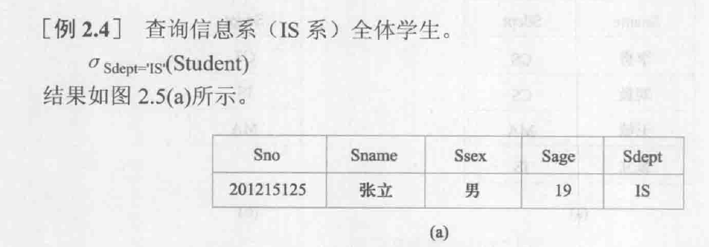

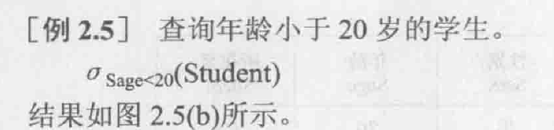

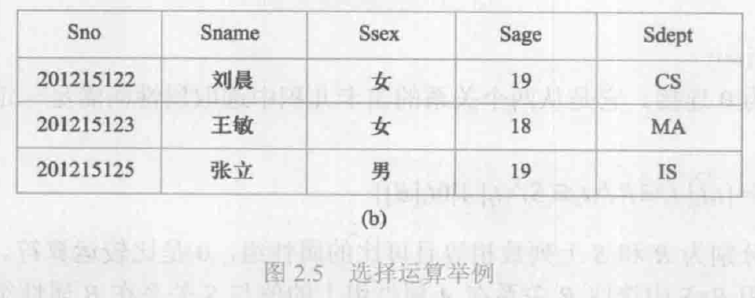

##### 投影（Projection）

投影取消重复元组


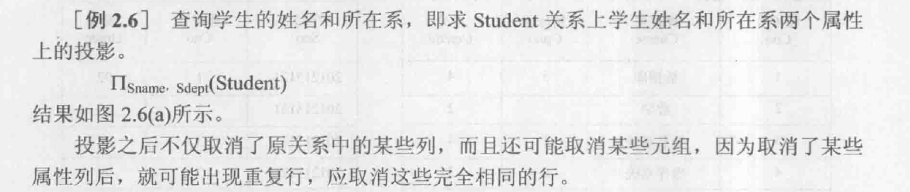

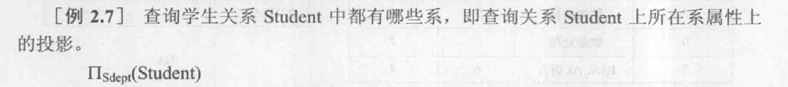

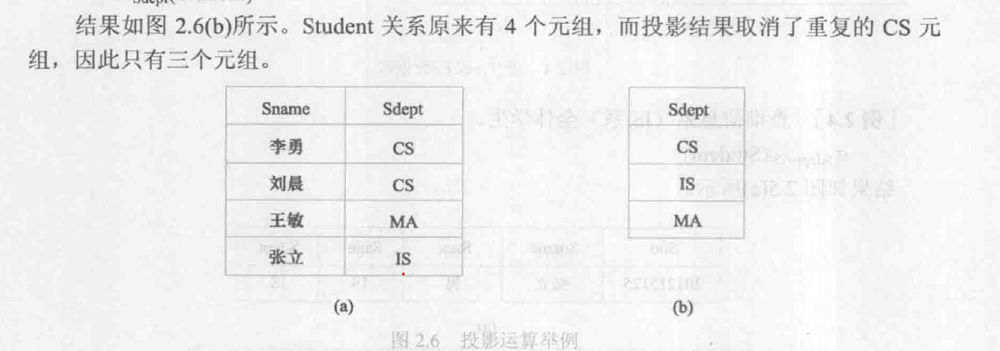

##### 连接

###### 等值连接 VS 自然连接

[等值连接和自然连接的区别，三种连接的辨析：非等值连接，等值连接，自然连接-CSDN博客](https://blog.csdn.net/qq_40212930/article/details/88747786)

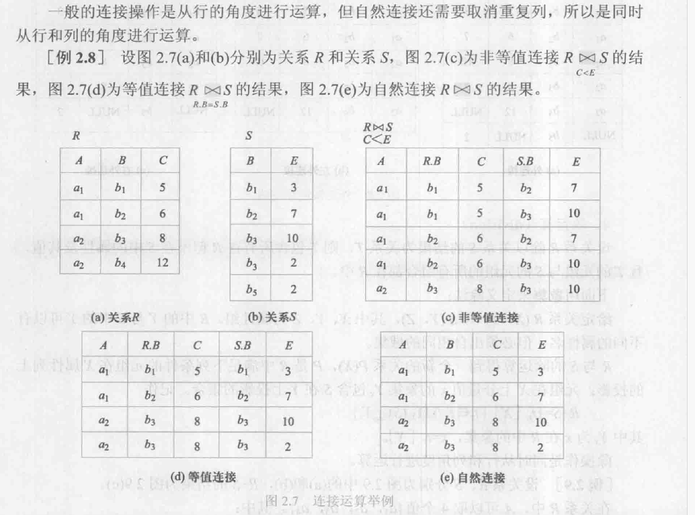

###### 悬浮元组和外连接

- 悬浮元组：两个关系R和S在做自然连接时，关系R中某些元组有可能在S中不存在公共属性上值相等的元组，从而造成R中这些元组在操作时**被舍弃**了，这些被舍弃的元组称为悬浮元组。例如,在图2.7(e)的自然连接中,R中的第4个元组,S 中的第5个元组都是被舍弃掉的悬浮元组。

  ```
  假如我们有两个表：
  一个员工表（Employees）：
  EmpID
  Department
  一个部门表（Departments）：
  DeptID
  DeptName
  若进行自然连接操作：
  Employees NATURAL JOIN Departments
  如果Employees表中有员工所在的部门编号（Department）不存在于Departments表中（也就是说在Departments表没有对应的DeptID），那么在进行自然连接时，这些员工的记录就会被排除在最终的连接结果中。这些未能成功连接的员工记录就构成了悬浮元组。这可能会在那些因为数据删除（如部门解散）或数据未同步（如新部门还未添加到Departments表）的情况下发生。
  ```
- 外连接：

  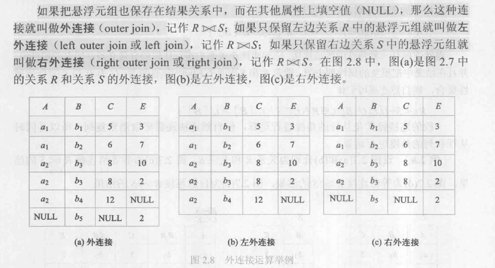

##### 除运算❗

[关系代数中的除法运算-腾讯云开发者社区-腾讯云 (tencent.com)](https://cloud.tencent.com/developer/article/1176184)

[如何理解关系代数中除运算？_关系代数除运算怎么理解-CSDN博客](https://blog.csdn.net/m0_37149062/article/details/119705171)

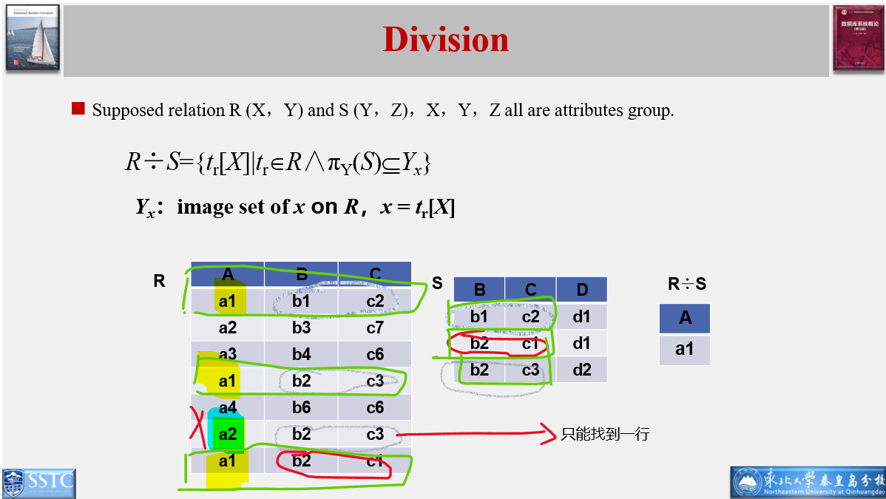

##### 几个关系运算例题❗

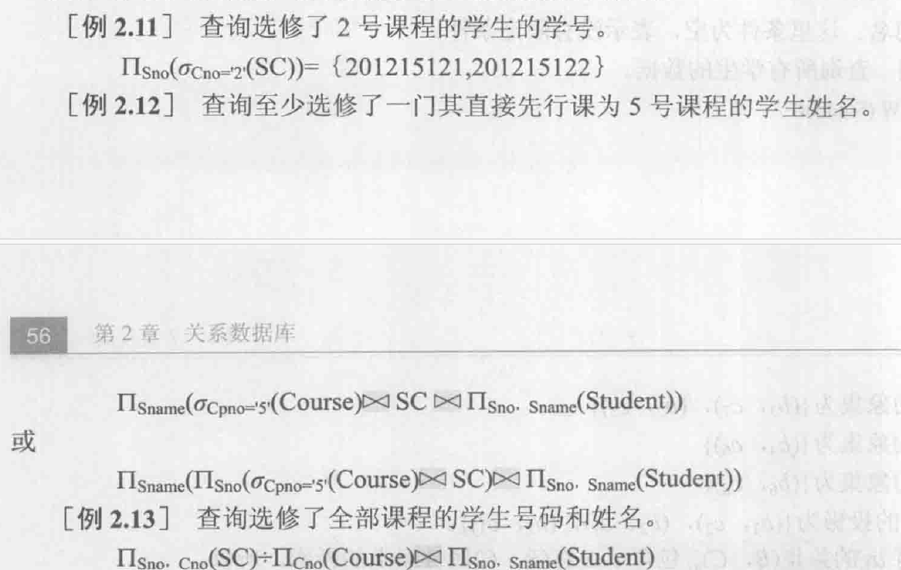

P70 课后练习题6（只要求掌握关系代数表达式）❗

[关系代数题目小汇总——数据库 - Aotle - 博客园 (cnblogs.com)](https://www.cnblogs.com/fuao2000/p/12405079.html)

```sql
（1）求供应工程J1零件的供应商号码SNO：

πSNO(σJNO=‘J1’（SPJ）)

（2）求供应工程J1零件P1的供应商号码SNO：

πSNO(σJNO=‘J1’∧PNO=‘P1’(SPJ))

（3）求供应工程J1零件为红色的供应商号码SNO：

πSNO(πSNO,PNO（σJNO=‘J1’(SPJ))∞πPNO（σCOLOR=’红‘（P）))

（4）求没有使用天津供应商生产的红色零件的工程号JNO：

πJNO(J)- πJNO（πSNO(σCITY=‘天津’(S))∞πSNO.PNO,JNO(SPJ)∞πPNO(σColor=‘红‘（P）)

（5）求至少用了供应商S1所供应的全部零件的工程号JNO：

πJNO，PNO(SPJ)÷πPNO（σSNO=‘S1’（SPJ））
除法操作在关系代数中用于找出左边关系中某属性的那些值，使得这些值和右边关系的所有值都存在于左边关系中。
```
